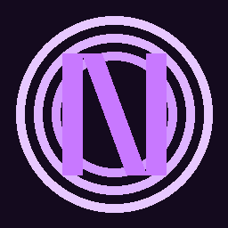

# NocLauncher v1.0.5

<p align="center">
  
</p>

<p align="center">
  <b>Кастомный Minecraft Launcher (Java + Bedrock)</b><br>
  <i>Offline-first лаунчер с быстрым запуском, диагностикой и удобными встроенными инструментами.</i>
</p>

<p align="center">
  <a href="https://github.com/NocCorporation/NocLauncher/releases/latest">
    
  </a>
  <a href="https://github.com/NocCorporation/NocLauncher/releases">
    
  </a>
  
  
</p>

---

## ✨ Актуальные возможности UI

- Java + Bedrock в одном лаунчере
- Профили Java: Vanilla / Forge / OptiFine
- Offline-first режим
- Библиотека модов/ресурсов/шейдеров
- Bedrock Hub (mini dock) с быстрыми переключателями
- Внешний FPS-монитор NocFpsCounter (ручной запуск)
- Доп. настройки Bedrock (presets + options.txt)
- MS Fix / Xbox Fixer / Deep Fix
- Проверка и диагностика запуска
- Эксперименты и утилиты

---

## 🆕 Что нового в v1.0.5

- Полная замена старого FPS-пути на внешний NocFpsCounter.exe
- Удалён старый нерабочий оверлей FPS:0
- FPS-монитор не запускается автоматически при старте Bedrock
- Переработан mini Bedrock Hub: плавность, выравнивание, компактность
- Кнопка открытия: **«Мультиплеер [Beta]»**
- Кнопка закрытия панели: **✕**
- Удалён дублирующий «Живой FPS» из лишнего раздела
- В UI добавлено отображение версии v1.0.5

---

## 📦 Скачать

Текущий релиз: `v1.0.5`

- Windows x64: `NocLauncher-1.0.5-windows-x64.exe`
- Windows x86: `NocLauncher-1.0.5-windows-x86.exe`
- Linux x64: `NocLauncher-1.0.5-linux-x64.AppImage`
- macOS x64: `NocLauncher-1.0.5-macos-x64.dmg` / `.zip`

Все файлы:
<https://github.com/NocCorporation/NocLauncher/releases>

---

## 🛡 Windows Defender / SmartScreen (важно)

Иногда Windows может предупреждать при запуске сборки. Это чаще связано с тем, что приложение **не подписано коммерческим code-sign сертификатом**, а не с подтверждённым наличием вируса.

Почему так происходит:
- unsigned/новые `.exe` получают низкую репутацию в SmartScreen;
- Defender и SmartScreen используют эвристику и репутацию издателя;
- для небольших проектов без платной подписи это типичная ситуация.

Как проверить безопасность корректно:
1. Скачивайте файлы только из официального GitHub Releases.
2. Сверяйте SHA256 с `SHA256SUMS-*`.
3. По желанию проверяйте файл в VirusTotal.

> Важно: предупреждение Windows само по себе не доказывает заражение, но и не должно игнорироваться без проверки хэша/источника.

---

## 🔐 Проверка целостности

```powershell
Get-FileHash .\NocLauncher-1.0.5-windows-x64.exe -Algorithm SHA256
```

Сверьте хэш с опубликованным в релизе файлом checksum.

---

## 🌐 Multiplayer Status (Beta)

Текущий мультиплеер в NocLauncher — локальный Beta.

Для полноценного общего (глобального) мультиплеера нужны:
- мощные хосты,
- стабильная серверная инфраструктура,
- постоянное финансирование.

На текущий момент финансирование закрыто, поэтому до полностью рабочего общего мультиплеера ещё далеко.

---

## 📄 Лицензия

MIT (`LICENSE`)
